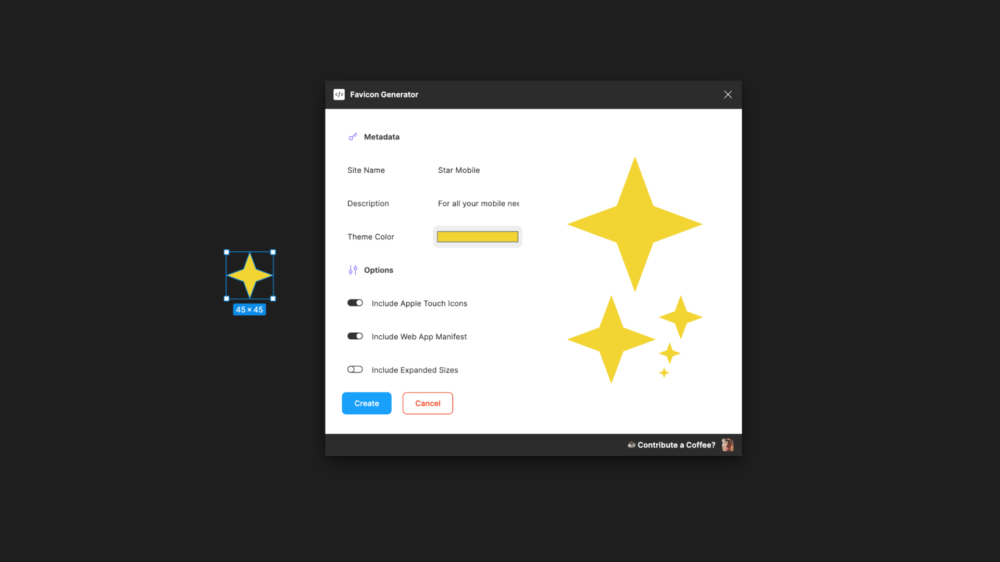
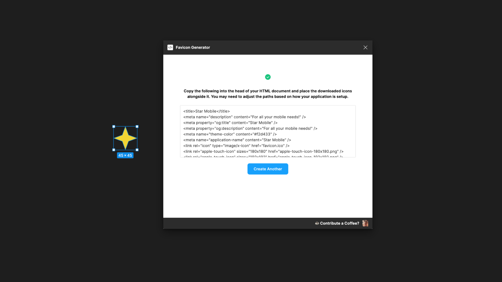

# Favicon Generator Figma Plugin

With this plugin you can easily export Favicons, App Icons and the associated HTML meta tags based on your current node selection. This tool is similar to other online favicon generators except you can instead conveniently do it directly from within Figma.

Special thank you to all the past and present [GitHub Sponsors](https://github.com/sponsors/JamesIves) 💖.

<!-- sponsors -->&nbsp;&nbsp;&nbsp;&nbsp;&nbsp;&nbsp;&nbsp;&nbsp;&nbsp;&nbsp;&nbsp;&nbsp;&nbsp;&nbsp;&nbsp;&nbsp;&nbsp;&nbsp;&nbsp;&nbsp;&nbsp;&nbsp;&nbsp;&nbsp;&nbsp;&nbsp;&nbsp;&nbsp;&nbsp;&nbsp;&nbsp;&nbsp;&nbsp;&nbsp;&nbsp;&nbsp;&nbsp;&nbsp;&nbsp;&nbsp;<!-- sponsors -->

## Getting Started

> [!TIP]
> This plugin is [available to install on the Figma Community site](https://www.figma.com/community/plugin/1390812275442512670).

If you'd like to run the project locally and make a change please [check out the contribution guide](./CONTRIBUTING.md). [Any problems can be reported via the issue board](https://github.com/JamesIves/figma-plugin-favicon-generator/issues).

