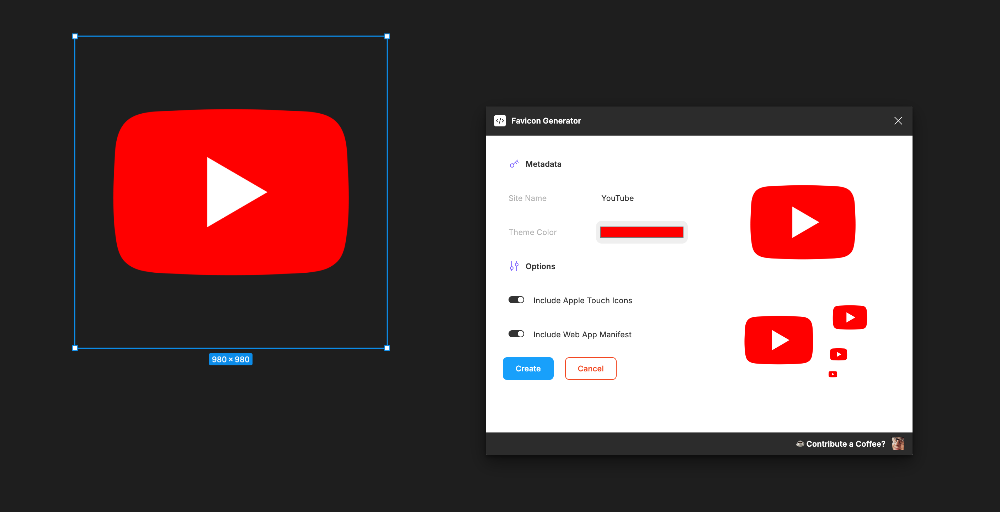
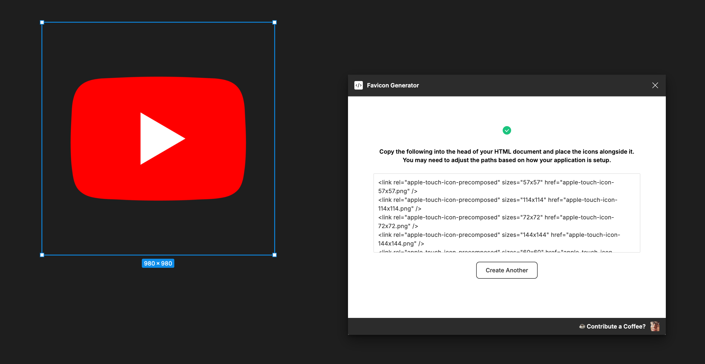

# Figma Plugin Favicon Generator

Generates a favicon icon based on current node selection, along with other site critical meta data such as web app manifest files, etc.

> [!WARNING]
> This is a temp README while this project is in development.

## Getting Started

1. Clone this repository or download it.
2. Run `npm install` followed by `npm run build`
3. Open the Figma Desktop App (Required for plugin dev)
4. Go to `Plugins > Development > Import Plugin from Manifest`
5. Choose the `manifest.json` file from the root.
6. Run the plugin.

If you want to make changes to the plugin:

1. Run `npm run build`
2. Restart the plugin from the Figma interface to see the latest changes.

## Under the Hood

- `src/code/code.ts` has access to the Figma document. To get data from it into the plugin code, events must be emitted back using `figma.ui.postMessage`. The Figma environment does not have access to all browser API's, it seems to be intentionally limited.
- `src/ui/UI.tsx` handles the plugin UI, and listens to events from Figma via `window.removeEventListener('message', handleFigmaMessage)`.
- `src/ui/image.worker.ts` is a web worker that handles image processing to prevent main thread lockup. It is defined with a bit of a hack as typically web workers must be an external script file.

